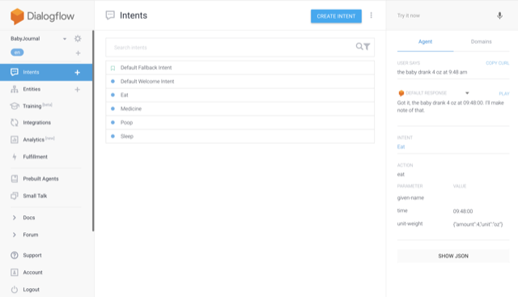

To support Google Home:

* Setup project on DialogFlow.
 * Enable Google Assistant.
 * Set webhook to your endpoint (https://babyjourn.al/incoming)
 * Endpoint must be SSL, follow instructions inside nginx directory
* Create intents
* You can test by entering in the text and then reviewing the JSON.
* There is a sample JSON file of output in the ruby directory, which can be tested by running `ruby processor_test.rb`

See screenshots below

